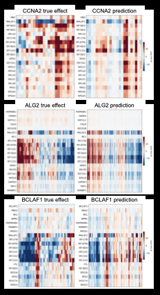

# PerturbFlow: An Open Platform for Single Cell Perturbation 

PerturbFlow is an open-source, AnnData-native platform that provides a unified
infrastructure layer for perturbation experiments including Perturb-seq, pooled CRISPR
screens, and single-cell multi-omics. It supports Perturb-seq, pooled CRISPR screens, and multimodal perturbation experiments through standardized data ingestion, quality control, perturbation-aware analysis, mechanistic interpretation, interactive reporting, and structured exports. 

The current release ships the `perturbflow.analyzer` subpackage for QC,
perturbation scoring, differential expression, trajectory effects, gene-network
rewiring, regulatory analysis, interactive reports, and structured
agent interpretation. The `perturbflow.predictor` and `perturbflow.benchmark`
namespaces are reserved for Aim 2 prediction and Aim 3 benchmarking.

## Modes

PerturbFlow is organized into four modes:

- **Analyzer**: processes perturbation datasets, runs QC and downstream biology
  analyses, builds gene-network and regulatory summaries, and generates reports.
- **Predictor**: supports perturbation-response prediction workflows and
  model-ready data exports.
- **Benchmarker**: supports reproducible comparison of perturbation models and
  analysis methods using baseline-aware and rewiring-aware outputs.
- **AI**: exports agent interpretation context so downstream AI tools can
  summarize results, compare runs, and review findings without requiring access
  to raw count matrices.

## What PerturbFlow Produces

- Standardized `.h5ad` input with consistent perturbation and optional cell-state annotations.
- Reproducible pipeline outputs: QC plots, DEG tables, trajectory summaries, program scores, gene networks, C-scores, regulatory results, and final AnnData.
- `report.html` and `interactive_report.html` for browser-based review.
- A viewer-ready `bundle/` directory for downstream web apps.
- `agent_handoff/` files that summarize the run for downstream review without including raw count matrices.

## Interface Preview

**Analyzer**


**Predictor**



## Install

```bash
git clone https://github.com/helenhuangmath/PerturbFlow.git
cd PerturbFlow
python -m pip install -e ".[bundle]"
```

<details>
<summary>Cluster install (existing conda environment, no dependency reinstall)</summary>

On an HPC cluster with a pre-built environment, install in place without
re-resolving dependencies:

```bash
source /path/to/anaconda3/etc/profile.d/conda.sh
conda activate /path/to/your/perturbflow_env
python -m pip install -e /path/to/PerturbFlow --no-deps
```

</details>

## Quick Start

Run the included real-data smoke test:

```bash
perturbflow prepare \
  --input examples/data/adamson_2016_upr_360x1000.h5ad \
  --output prepared/adamson_2016_upr.perturbflow.h5ad \
  --perturbation-col guide_gene \
  --control-labels non-targeting \
  --cell-state-col cell_state_hint
```

```bash
perturbflow analyzer \
  --input prepared/adamson_2016_upr.perturbflow.h5ad \
  --output results/adamson_2016_upr_quickstart \
  --config configs/quickstart.json \
  --no-resume
```

Open:

```text
results/adamson_2016_upr_quickstart/interactive_report.html
```

Prepare your own AnnData file:

```bash
perturbflow prepare \
  --input my_raw_data.h5ad \
  --output prepared/my_data.perturbflow.h5ad \
  --perturbation-col guide_gene \
  --control-labels control,non-targeting,NT \
  --cell-state-col leiden
```

Run the analysis:

```bash
perturbflow analyzer \
  --input prepared/my_data.perturbflow.h5ad \
  --output results/my_run \
  --config configs/cluster_default.json \
  --resume
```

Open the main report:

```text
results/my_run/interactive_report.html
```

Create the agent interpretation package:

```bash
perturbflow interpret \
  --results results/my_run \
  --project-name "K562 essential gene Perturb-seq"
```

This writes:

```text
results/my_run/agent_handoff/
├── agent_manifest.json
├── agent_prompt.md
├── interpretation_context.md
└── machine_context.json
```

Example `interpretation_context.md` excerpt:

```markdown
# K562 essential gene Perturb-seq interpretation context

This file summarizes derived tables and report artifacts; it does not include
raw count matrices.

## Dataset overview

- Results directory: `results/my_run`
- Cells: 360
- Genes: 1000
- Perturbations: 6
- Completed steps: qc, preprocess, deg, genenet, cscore, regulatory, report, bundle
- Bundle schema: 1.0

## Top differential-expression perturbations

| perturbation | n_de_total | n_de_up | n_de_down | top_up_gene | top_down_gene |
| --- | --- | --- | --- | --- | --- |
| ATF4 | 148 | 81 | 67 | DDIT3 | RPLP1 |
| DDIT3 | 121 | 62 | 59 | PPP1R15A | RPS12 |

## Strongest connectivity rewiring signals

| perturbation | c_total | c_gain | c_loss | c_shift |
| --- | --- | --- | --- | --- |
| ATF4 | 0.42 | 0.25 | 0.17 | 0.31 |
```

Example `machine_context.json` excerpt:

```json
{
  "project_name": "K562 essential gene Perturb-seq",
  "results_dir": "results/my_run",
  "deg_top": [
    {
      "perturbation": "ATF4",
      "n_de_total": "148",
      "top_up_gene": "DDIT3"
    }
  ],
  "cscore_top": [
    {
      "perturbation": "ATF4",
      "c_total": "0.42",
      "c_gain": "0.25",
      "c_loss": "0.17"
    }
  ]
}
```

Review these files before sharing them outside your analysis environment.

## Expected Input

Minimum input is an AnnData `.h5ad` file with cells in rows, genes in columns, and one `.obs` column containing perturbation labels.

Recommended optional columns:

- Cell state, cluster, or lineage label for state-aware interpretation.
- Guide ID when target gene and guide are separate.
- Replicate or batch labels for downstream review.
- Existing QC metrics if already computed.

PerturbFlow standardizes common control labels such as `control`, `ctrl`, `NT`, `non-targeting`, and `scramble`.

## Main Commands

```bash
perturbflow prepare      # Standardize input .h5ad metadata
perturbflow analyzer     # Run the analyzer workflow
perturbflow analyze      # Alias for analyzer
perturbflow run          # Legacy alias for analyzer
perturbflow predict      # Reserved for future predictor features (Aim 2)
perturbflow benchmark    # Reserved for community evaluation tooling (Aim 3)
perturbflow interpret    # Export agent interpretation context
perturbflow list-steps   # Show available pipeline steps
```

## Python API

Other programs can run PerturbFlow without shelling out to the CLI:

```python
from perturbflow import PerturbFlowAPI

api = PerturbFlowAPI(
    config="configs/quickstart.json",
    perturbation_col="perturbation",
)

prepared = api.prepare(
    input_path="raw/my_data.h5ad",
    output_path="prepared/my_data.perturbflow.h5ad",
    control_labels="control,NT",
    cell_state_col="cell_type",
)

adata = api.analyze(
    input_path=prepared,
    output_dir="results/my_run",
    steps=["qc", "preprocess", "deg", "report", "bundle"],
)
```

For already standardized data, call `api.analyze(...)` directly. Use
`api.list_steps()` to inspect the configured default workflow.

## Pipeline Steps

Default analysis steps include:

```text
qc -> preprocess -> eda -> score -> effects -> trajectory -> programs
-> interaction -> state_enrich -> deg -> genenet -> tf_genenet
-> cscore -> regulatory -> report -> bundle
```

Step-only reruns are useful while tuning reports:

```bash
perturbflow analyzer --input prepared/my_data.perturbflow.h5ad --output results/my_run --steps deg,report,bundle
perturbflow analyzer --input prepared/my_data.perturbflow.h5ad --output results/my_run --force-steps report --resume
```

## Repository Layout

```text
perturbflow/   # Python package, CLI, Analyzer, Predictor, Benchmarker, and AI APIs
configs/       # Example pipeline configurations
examples/      # Example data and workflows
docs/          # Documentation and design notes
scripts/       # Companion scripts
tests/         # Test suite
```

## Project Documents

- [`docs/DESIGN.md`](docs/DESIGN.md) / [`docs/METHOD.md`](docs/METHOD.md) — architecture and methods.

## Web Documentation

The docs are built with MkDocs Material:

```bash
python -m pip install -e ".[docs]"
mkdocs serve
```

Then open the local URL printed by MkDocs. The docs structure is inspired by practical package documentation such as Seurat: installation, quick start, data preparation, analysis workflow, interpretation, and examples.

## Example Notebooks

Notebook templates are available in [`examples/`](examples/):

- `01_prepare_and_run.ipynb`: prepare data and run the full pipeline.
- `02_step_rerun_and_config.ipynb`: customize config and rerun selected steps.
- `03_interpret_with_agents.ipynb`: create agent interpretation files.
- `04_explore_outputs.ipynb`: inspect result tables, reports, and bundles.

## Agent Interpretation

PerturbFlow does not send data to any external service automatically. Instead,
`perturbflow interpret` creates a compact agent interpretation package with:

- A human-readable interpretation context.
- A reusable analysis prompt.
- A machine-readable JSON summary.
- A manifest describing suggested review roles.

This makes it possible to connect outputs to collaborative review and
report-writing workflows while preserving analyst control over privacy and
provenance.

## Development

```bash
python -m pip install -e ".[dev,bundle]"
pytest
```

Generated result folders, large `.h5ad` files, caches, logs, and local notebooks are ignored by git by default.
